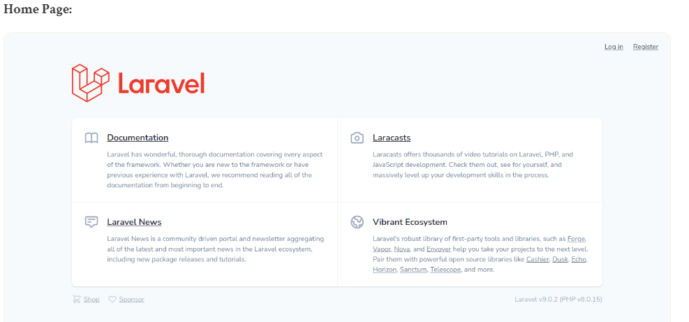
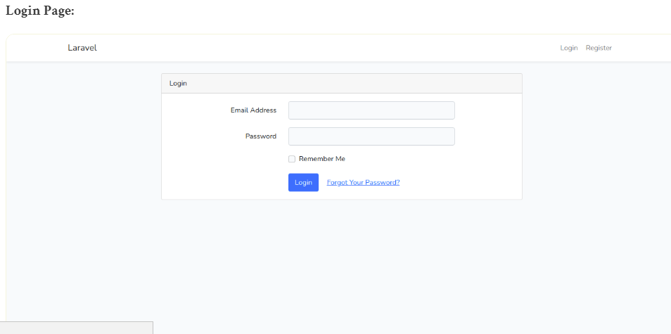
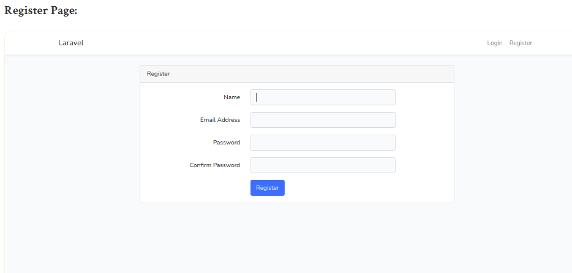
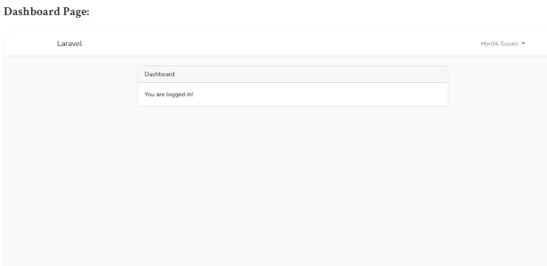
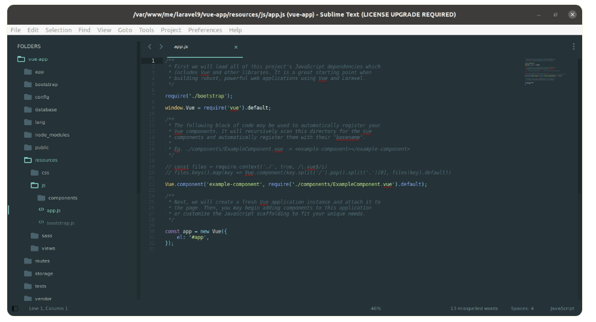
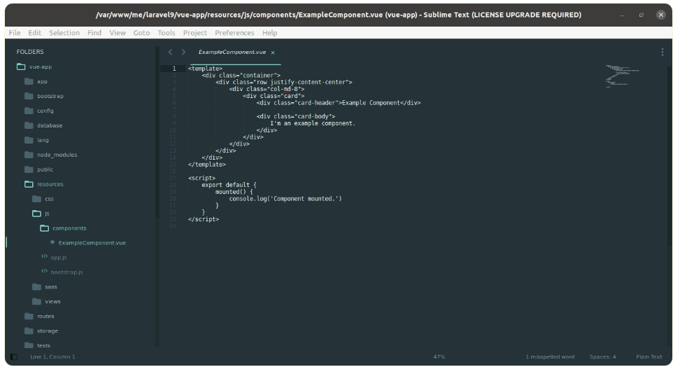

# laravel9_vue_js_auth-scaffolding
## 1. Install Laravel 9
```Dockerfile
composer create-project laravel/laravel:^9.0 laravel9_vue_js_auth-scaffolding
```
## 2. Install Laravel UI
```Dockerfile
composer require laravel/ui
```
- cài đặt laravel ui package với command tạo  auth scaffolding sử dụng vue
```Dockerfile
php artisan ui vue 
OR 
php artisan ui vue --auth
```
- command cài đặt npm
```Dockerfile
npm install && npm run dev
```
- Nó sẽ tạo ra các tệp CSS và js
```Dockerfile
php artisan migrate
```
## 3.Run Laravel App:
```Dockerfile
php artisan serve
```
- Vào http://localhost:8000/
 
 
 
 
 
Bạn có thể thấy ảnh chụp màn hình dưới đây mà laravel ui tạo js và thiết lập thành phần:



